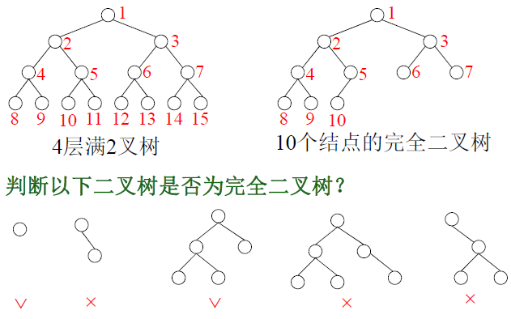
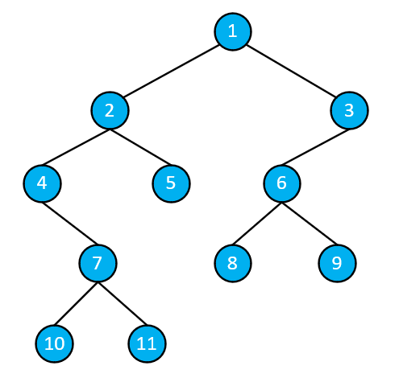

# 一.什么是树？

**树的递归定义**：树是由0个节点或多个节点组成的有限集合$T$，它满足下面两个条件：

- 有一个特定的结点，称之为根结点；
- 其余节点分成$m(m\geq0)$个互不相交的有限集合$T_1,T_2,...,T_m$，其中每个集合都是一棵树，称之为根节点的**子树**。

树的每个结点都是一个对象，其包含**数据域和指向其它结点的指针**。

树的相关概念：

| 概念     | 说明                                                         |
| -------- | ------------------------------------------------------------ |
| 孩子     | 树中某个结点的子树的根                                       |
| 双亲     | 结点的直接前驱                                               |
| 兄弟     | 同一双亲的孩子互称兄弟                                       |
| 结点的度 | 结点拥有子树的数目                                           |
| 叶子     | 度为零的结点                                                 |
| 度       | 树中各节点度的最大值                                         |
| 结点层次 | 从根结点到某结点路径上的节点数（含该结点本身）               |
| 有序树   | 若树中结点的==各子树从左到右都是有次序的==，则称该树为有序树，否则为无序树 |

# 二.什么是二叉树？

二次有序树称为二叉树。二次指结点的**度最大是2**，即每个结点的子树数目可能为0、1、2。有序指如果结点有两棵子树，则这两棵子树有次序关系，分别称为左子树和右子树。左、右子树的根节点分别称为其双亲的左儿子和右儿子。度为1的结点有两种情形，即该结点自由左子树或只有右子树。

二叉树的示意图如下所示：


## 二叉树的性质

**性质1**：在二叉树的第$i(i\geq1)$层上，至多有$2^{i-1}$个结点。

**性质2**：深度为$k$的二叉树至多有$2^k-1$个结点。

**性质3**：对任意一棵二叉树，若其叶子结点树为$n_0$，度为2的结点为$n_2$，则$n_0 = n_2 + 1$。

## 扩展概念

**满二叉树**：一棵深度为$k$且有$2^k - 1$个结点的二叉树。

------

**完全二叉树**：一棵深度为$k$且有$n$个结点的二叉树，当且仅当每个结点的编号与深度为$k$的满二叉树中编号$1~n$一一对应时，称为完全二叉树。其编号方法是：**从根节点开始，层次从上至下，每层从左向右，从1开始依次为每个结点编号。即对于$k$完全二叉树，前$k-1$层必为满二叉树，在第$k$层，任意结点左边不能有空位**。

完全二叉树的性质：

- 设$k$层完全二叉树有$n$个结点，则$n$的范围为$2^{k-1}\leq n \leq 2^k-1$。
- $n$个结点的完全二叉树的高度为$\lfloor \text{log}_2n\rfloor$。
- $n$个结点的完全二叉树中，编号为$i(1\leq i \leq n)$的结点的左、右儿子若存在，则它们的编号分别为$2i$和$2i+1$。该性质的推论为完全二叉树中，结点$i$的双亲编号为$\lfloor i/2 \rfloor$。
- $n$个结点的完全二叉树中，设度为$1$的结点数为$n_1$。当$n$为奇数时，$n_1=0$，当$n$为偶数时，$n_1=1$。

满二叉树和完全二叉树示意图如下：



# 三.二叉树的存储

## 3.1 顺序存储结构

**完全二叉树**：适用于一维数组按结点编号顺序存储每个结点。对数组$a_0,a_1,...,a_{n-1}$，$a_i$的左右儿子和双亲的下标为$2i+1$和$2i+2$，$\lfloor (i-1)/2 \rfloor$。

**非完全二叉树**：按完全二叉树存储，无结点处用空元素占位。

## 3.2 链式存储

链式存储指二叉链表的存储格式，其比较常用。

二叉链表中结点对应的类为：

```c++
template <typename T>
class node
{
    T data;              // 数据域
    struct node *lchild; // 左指针
    struct node *rchild; // 右指针
};
```

## 3.3 三叉链表

在二叉链表的基础上增加一个双亲指针。

```c++
template <typename T>
class node
{
    T data;              // 数据域
    struct node *parent; // 双亲指针
    struct node *lchild; // 左指针
    struct node *rchild; // 右指针
};
```

# 四.二叉树的相关算法

## 4.1 遍历

二叉树的遍历指按某种次序访问二叉树的每个结点一次且仅一次，包括有：

- **先序遍历**：先访问根节点，再左子树，然后右子树。
- **中序遍历**：先访问左子树，再根节点，然后右子树。
- **后序遍历**：先访问左子树、然后右子树，最后是根节点。
- **层次遍历**：节点按层次，每层从左向右依次遍历。

### 4.1.1 先序遍历

递归版遍历算法实现如下：

```cpp
void preorder(TreeNode *root, vector<int> &ans)
{
    if (root)
    {
        ans.push_back(root->data);
        preorder(root->lchild, ans);
        preorder(root->rchild, ans);
    }
}
```

非递归版本的先序遍历算法实现为：

```cpp
void preorder_nre(TreeNode * root, vector<int> &ans)
{
    stack<TreeNode *> s;
    while(root || !s.empty())
    {
        if(root)
        {
            ans.push_back(root->data);
            s.push(root);
            root = root->lchild;
        }
        else{
            root = s.top();
            s.pop();
            root = root->rchild;
        }
    }
}
```


### 4.1.2 中序遍历

递归版遍历算法实现如下：

```cpp
void midorder(TreeNode *root, vector<int> &ans)
{
    if (root)
    {
        midorder(root->lchild, ans);
        ans.push_back(root->data);
        midorder(root->rchild, ans);
    }
}
```

非递归版本的算法实现为：

```cpp
void midorder_nre(TreeNode *root, vector<int> &ans)
{
    stack<TreeNode *> s;
    while(root || !s.empty())
    {
        if(root)
        {
            s.push(root);
            root = root->lchild;
        }
        else{
            root = s.top();
            s.pop();
            ans.push_back(root->data);
            root = root->rchild;
        }
    }
}
```


### 4.1.3 后序遍历

递归版本遍历算法实现如下：

```cpp
void lastorder(TreeNode *root, vector<int> &ans)
{
    if (root)
    {
        lastorder(root->lchild, ans);
        lastorder(root->rchild, ans);
        ans.push_back(root->data);
    }
}

```

非递归版本的遍历算法实现为：

```cpp
void lastorder_nre(TreeNode *root, vector<int> &ans)
{
    stack<pair<TreeNode *, int>> s;
    while(root || !s.empty())
    {
        if(root)
        {
            s.push({root, 0});
            root = root->lchild;
        }
        else{
            auto temp = s.top();
            root = temp.first;
            s.pop();
            // 从左子树返回的
            if(temp.second == 0)
            {
                s.push({root, 1});
                root = root->rchild;
            }
            // 从右子树返回，此时需要访问根节点
            else{
                ans.push_back(root->data);
                root = NULL;
            }
        }
    }
}
```


### 4.1.4 层次遍历

层次遍历需要借助队列，其具体实现如下：

```cpp
void layer_travel(TreeNode *root, vector<int> &ans)
{
    queue<TreeNode *> q;
    q.push(root);
    while (!q.empty())
    {
        TreeNode *cur_node = q.front();
        q.pop();
        ans.push_back(cur_node->data);
        if(root->lchild)
            q.push(root->lchild);
        if(root->rchild)
            q.push(root->rchild);
    }
}
```


## 4.2 构建

二叉树可以采用与上述遍历过程的顺序来进行创建，以层次遍历为例，其对应算法实现为：

```cpp
/**
 * 层次遍历的方式构建二叉树
 * 用-1表示空
 */
TreeNode *build_binary_tree(vector<int> &nums)
{
    int n = nums.size();
    TreeNode *root = new TreeNode();
    int i = 0;
    root->data = nums[i++];
    queue<TreeNode *> q;
    q.push(root);
    while (!q.empty())
    {
        TreeNode *cur_node = q.front();
        q.pop();
        // create left child node
        if (i < n)
        {
            if (nums[i] != EMPTY)
            {
                TreeNode *lnode = new TreeNode();
                lnode->data = nums[i];
                cur_node->lchild = lnode;
                q.push(lnode);
            }
            i++;
        }
        // create right child node
        if (i < n)
        {
            if (nums[i] != EMPTY)
            {
                TreeNode *rnode = new TreeNode();
                rnode->data = nums[i];
                cur_node->rchild = rnode;
                q.push(rnode);
            }
            i++;
        }
    }
    return root;
}
```

给出二叉树示例为：



其对应的测试代码为：

```cpp
vector<int> arr = {
    1, 2, 3, 4, 5, 6, EMPTY, EMPTY, 7, EMPTY, EMPTY, 8, 9, 10, 11, EMPTY, EMPTY, EMPTY, EMPTY};    
TreeNode *root = build_binary_tree(arr);
vector<int> porder, morder, lorder, lt;
preorder(root, porder); // 1 2 4 7 10 11 5 3 6 8 9
midorder(root, morder); // 4 10 7 11 2 5 1 8 6 9 3
lastorder(root, lorder); // 10 11 7 4 5 2 8 9 6 3 1
layer_travel(root, lt); // 1 2 3 4 5 6 7 8 9 10 11
```

