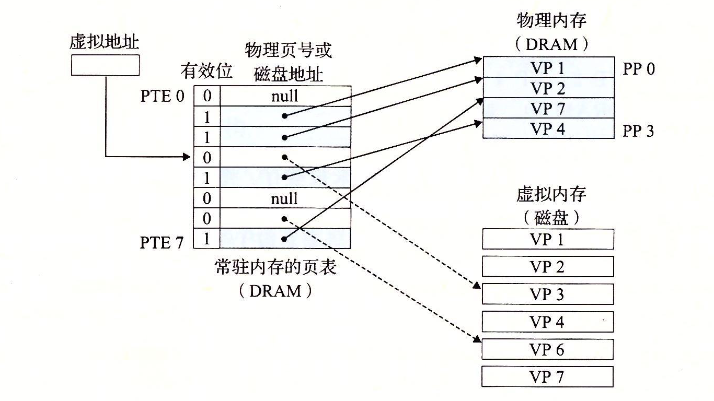

# 一.LRU算法的由来

LRU算法最早用于操作系统虚拟内存中的页面置换。在操作系统中，进程创建加载时都会创建一块连续的虚拟地址空间（虚拟内存），这块虚拟地址空间会被分割为一个个的**虚拟页**（Virtual Page），同样地物理内存也被分割为一个个的物理页。对于进程而言，操作系统会提供一个页表来记录进程的各个虚拟页的状态，即**虚拟页是在物理内存中还是在磁盘中**（参见下图示例）。当进程访问某个虚拟地址时，会先去页表看看对应的数据是否在物理内存中，不在则会引发**缺页异常**。发生缺页异常后，系统需要将进程需要访问的虚拟页复制到物理内存中，而限于物理内存是有限的，可能需要在物理内存中选择一个**牺牲页**，将其复制到磁盘中去。

对于虚拟内存而言，存在多种页面置换算法，其中LRU就是其中最常用的。LRU的英文全称是Least Recently Used，即最近最少被使用的，顾名思义，该算法**会选择最近很久没用过的物理页作为牺牲页**。



> 图源自参考资料二，侵权删。

# 二.LRU算法的实现

利用**哈希表**和**双向链表**可以很容易的实现LRU算法。

LRU的算法思路为：

- 需要设置缓存的最大容量。
- 当需要插入新的数据页时，如果新数据页在链表中存在，则将该结点移动到链表头部，如果不存在，则创建一个新结点，将其放置到链表头部，若缓冲满了，则把链表的最后一个结点删除。
- 当访问数据页时，若数据页在链表中存在，则将该结点移至链表头部，否则返回-1。如此，链表尾部的结点就是最近最久未被访问的数据页了。

LRU算法的C++实现为：

```cpp
class LRUCache
{
private:
    int capacity;                                           // 缓存的最大容量
    list<pair<int, int>> cache;                             // 缓存
    unordered_map<int, list<pair<int, int>>::iterator> map; // 哈希表, 记录每个页面的存储位置
public:
    LRUCache(int cap)
    {
        capacity = cap;
    }

    int get(int key);

    void put(int key, int value);
};

int LRUCache::get(int key)
{
    if (map.count(key) > 0) // 数据页在缓存中存在
    {
        auto node = *map[key];
        cache.erase(map[key]);    // 将数据页从链表中删除
        cache.push_front(node);   // 将数据页移动到链表头部
        map[key] = cache.begin(); // 更新哈希表中该数据页的地址
        return node.second;
    }
    return -1; // 不存在直接返回-1
}

void LRUCache::put(int key, int value)
{
    if (map.count(key) > 0)
    {
        cache.erase(map[key]);
    }
    else if (capacity == cache.size()) // 缓存满, 删除链表尾部的结点
    {
        auto node = cache.back();
        map.erase(node.first);
        cache.pop_back();
    }
    cache.push_front({key, value}); // 将新结点放置的链表头部
    map[key] = cache.begin();
}
```

LRU的完整实现：[lru.cpp](https://github.com/sxwee/Data-Structures-and-Algorithms/blob/main/codes/algo/lru.cpp)

# 参考资料

[如何理解虚拟内存](https://zhuanlan.zhihu.com/p/96098896)

[LRU算法原理解析](https://www.cnblogs.com/linxiyue/p/10926944.html)