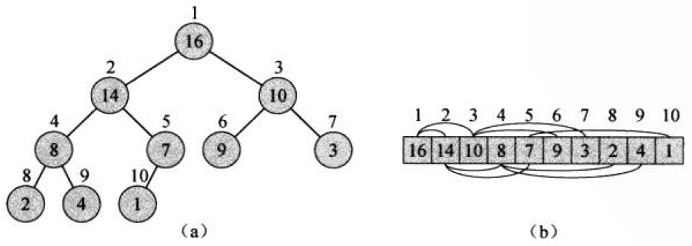
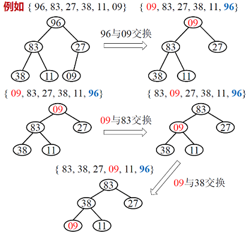
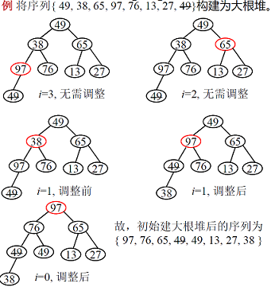
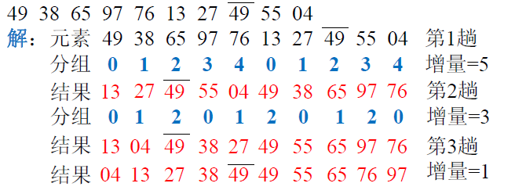

**说明**：假定待排序的数组为$R[0...n-1]$，下面介绍以升序排序为例。

**排序算法复杂度汇总**

| 排序算法 | 算法复杂度               |
| -------- | ------------------------ |
| 冒泡排序 | $O(n^2)$                 |
| 选择排序 | $O(n^2)$                 |
| 插入排序 | $O(n^2)$                 |
| 归并排序 | $O(n\text{ log }n)$      |
| 快速排序 | $O(n\text{ log }n)$      |
| 堆排序   | $O(n\text{ log }n)$      |
| 希尔排序 | $O(n(\text{log}_2 n)^2)$ |


# 冒泡排序

算法步骤：

- $R[0..n-1]$将最大元素浮动到$R[n-1]$位置。
- $R[0..n-2]$将最大元素浮动到$R[n-2]$位置。
- ...
- $R[0..1]$将最大元素浮动到$R[1]$位置。


# 选择排序

算法步骤：

- $R[0..n-1]$选出最小值与$R[0]$交换。
- $R[1..n-1]$选出最小值与$R[1]$交换。
- ...
- $R[n-2..n-1]$选择最小值与$R[n-2]$交换


# 插入排序

算法步骤：

- $R[0..0]$升序，$R[1]$插入使得$R[0..1]$升序。
- $R[0..1]$升序，$R[2]$插入使得$R[0..2]$升序。
- ...
- $R[0..n-2]$升序，$R[n-1]$插入使得$R[0..n-1]$升序。


# 归并排序

归并排序主要分为两个步骤：

- **划分**：递归地将当前序列平均划分为两半。
- **合并**：归并划分的两个已经有序的子序列。

## 递归法

1. 申请空间，使其大小为两个已经排序序列之和，该空间用来存放合并后的序列
2. 设定两个指针，最初位置分别为两个已经排序序列的起始位置
3. 比较两个指针所指向的元素，选择相对小的元素放入到合并空间，并移动指针到下一位置
4. 重复步骤3直到某一指针到达序列尾
5. 将另一序列剩下的所有元素直接复制到合并序列尾

## 迭代法

原理如下（假设序列共有$n$个元素）：

1. 将序列每相邻两个数字进行归并操作，形成$ceil(n / 2)$个序列，排序后每个序列包含两/一个元素
2. 若此时序列数不是1个则将上述序列再次归并，形成$ceil(n / 4)$个序列，每个序列包含四/三个元素
3. 重复步骤2，直到所有元素排序完毕，即序列数为1

# 快速排序

**算法原理**：设待排记录下标范围为 $R[s . . t]$, 任选一个记录称为枢轴(或支点)(pivot), 设法将枢轴通过移动和交换元素的操作放置到排序后的正确位置 $R[i]$, 然后对 $R$ [s..i-1] 和R[i+1..t]分别进行快速排序(递归思想)。

算法步骤：

- 挑选基准值：从数列中挑出一个元素，称为“基准”（pivot），
- 分割：重新排序数列，所有比基准值小的元素摆放在基准前面，所有比基准值大的元素摆在基准后面（与基准值相等的数可以到任何一边）。在这个分割结束之后，对基准值的排序就已经完成，
- 递归排序子序列：递归地将小于基准值元素的子序列和大于基准值元素的子序列排序。

# 堆排序

**（二叉）堆**：堆是一个数组，它可以被看成一个近似的完全二叉树，树上的每个节点都对应数组中的一个元素，**除了最底层外，该树是完全充满的，而且都是从左向右填充**。下图展示的便是一个堆的数组形式和二叉树形式：



二叉堆可以分为两种：

- **最大堆**：每个节点的值都大于等于其孩子节点的值。
- **最小堆**：每个节点的值都小于等于其孩子节点的值。

根据大根堆的性质可知，大根堆对应的二叉树的根节点的值是所有元素值中最大的，据此可以进行堆排序，其具体思想是：

- $\mathrm{R}[0] \leftrightarrow \mathrm{R}[n-1]$，$\mathrm{R}[0 . . n-2]$ 调整为大根堆
- $\mathrm{R}[0] \leftrightarrow \mathrm{R}[n-2]$，$\mathrm{R}[0 . . n-3]$ 调整为大根堆
- ...
- $\mathrm{R}[0] \leftrightarrow \mathrm{R}[n-i]$，$\mathrm{R}[0 . . n-i-1]$ 调整为大根堆
- ...
- $\mathrm{R}[0] \leftrightarrow \mathrm{R}[1]$，$\mathrm{R}[0 . .0]$ 调整为大根堆

**a.堆顶元素$R[0]$与$R[n-i]$交换后，如何将剩余的元素$R[0..n-i-1]$调整为堆？**

从根节点出发，向下调整：取根节点、左、右儿子中最大的元素与根节点元素交换，直到调整到叶子节点或根节点就是三者中的最大元。将$96$与$09$交换后，剩余元素调整为大根堆的示意图如下：



**b.初始序列$R[0..n-1]$如何建堆？**

从下标最大的非终端结点 $\mathrm{R}[\lfloor n / 2\rfloor-1]$ 开始, 按 下标减 1 次序循环到 $R[0]$, 对第 $i$ 趟循环，用 $\mathbf{a}$.方法从 $\mathrm{R}[i]$ 出发向下进行调整 $(i=|n / 2|-1, \ldots, 2,1,0)$ 。构建示意图如下：



> 为啥是$\mathrm{R}[\lfloor n / 2\rfloor-1]$ ？
>
> 因为对于完全二叉树，对于节点$i$，其双亲结点为$\lfloor i / 2\rfloor$（向下取整），即到最后一个非终端结点。


# 希尔排序

**参考资料**：[维基百科](https://zh.wikipedia.org/zh-hans/%E5%B8%8C%E5%B0%94%E6%8E%92%E5%BA%8F)

希尔排序是一种更高效的插入排序算法。

希尔排序通过将比较的全部元素分为几个区域来提升插入排序的性能。这样可以让一个元素可以一次性地朝最终位置前进一大步。然后算法再取越来越小的步长进行排序，算法的最后一步就是普通的插入排序，但是到了这步，需排序的数据几乎是已排好的了（此时插入排序较快）。

希尔排序是基于插入排序的以下两点性质而提出改进方法的：

- 插入排序在对几乎已经排好序的数据操作时，效率高，即可以达到线性排序的效率
- 但插入排序一般来说是低效的，因为**插入排序每次只能将数据移动一位**

希尔排序的示意如下：



从上图可以希尔排序对元素进行划分时是**按索引对增量取模**的方式，例如第$1$趟时，对索引按$5$取模可以将元素划分为$4$个区域，然后各个区域分别进行插入排序，然后取下一个增量重复上述过程，直至最后一趟增量为$1$完成后排序算法结束。

可知增量的选择是希尔排序中最重要的部分，假定数组有$n$个元素，可以**取初始增量为$\text{gap} = n / 2$，并继续以$\text{gap} = \text{gap} / 2$的方式缩小增量**。

希尔排序的C++实现如下：

```cpp
/**
 * 希尔排序
 * 算法复杂度O(n(\text{log}_2 n)^2)
 */
template <class T>
void shell_sort(T *arr, int n)
{
    int gap = n >> 1; // 初始化增量为gap = n / 2
    while (gap > 0)
    {
		// 对不同的分组jin'x
        for (int i = gap; i < n; ++i)
        {
            int t = arr[i];
            int j = 0;
            for (j = i - gap; j >= 0 && arr[j] > t; j -= gap)
            {
                arr[j + gap] = arr[j];
            }
            arr[j + gap] = t;
        }
        gap >>= 1;
    }
}
```

