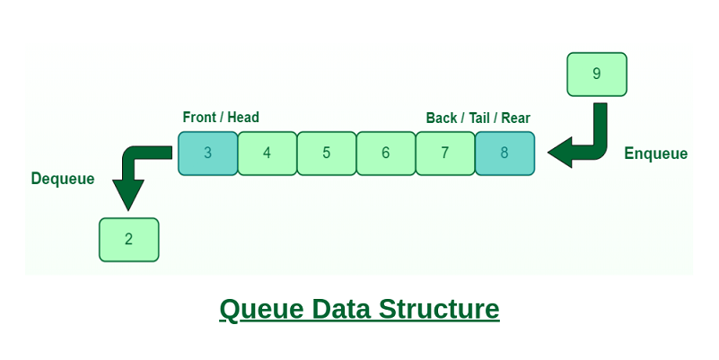

# 一.什么是队列

队列是一种**先进先出（First In First Out，FIFO）**的线性数据结构。下图便是一个队列的示意图，其中Front端为队头（只能删除元素），Back端为队尾（只能追加元素）。

# 二.队列的常见操作

队列的常见操作包括：

- `Push`：队尾压入元素

- `Pop`：队头元素出队

代码实现：[queue.h](https://github.com/sxwee/Data-Structures-and-Algorithms/blob/main/codes/ds/queue/queue.h)