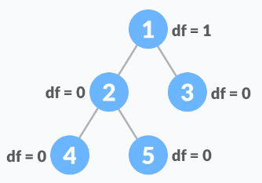

# 一.平衡二叉树的定义

**结点的高度**：从结点到叶结点的最长路径。

**结点的平衡因子**：指该结点左子树和右子树的高度差。

**平衡二叉树**：各结点的平衡因子的绝对值最大为$1$，即结点的平衡因子只有$-1,0,+1$三种情形。下面便展示了平衡二叉树的例子：



注意：这里指的是**高度平衡二叉树**。

# 二.平衡二叉树的相关算法

## 2.1 判断二叉树是否平衡

要判断二叉树是否平衡，需要判断每个结点的平衡因子的绝对值是否小于等于$1$，即：

```

```

## 2.2 插入结点


## 2.3 删除结点

