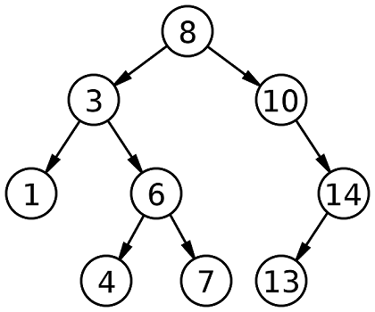
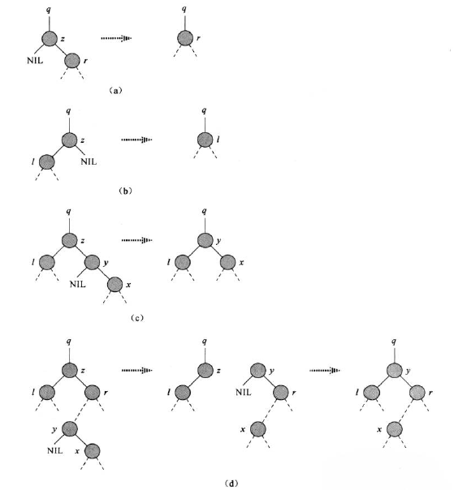

# 一.什么是二叉搜索树

二叉搜索树（binary search tree, BST）又被称之为**二叉排序树**，其是一棵**空二叉树**或具有如下性质的二叉树：

- 若它的左子树不为空，则左子树上的所有结点的关键字（key）的值都小于根节点的关键字的值。
- 若它的右子树不为空，则右子树上的所有结点的关键字的值都大于（或等于）根节点的关键字的值。
- 它的左子树和右子树也是二叉搜索树。

下图为二叉搜索树的示例：



**重要性质**：中序遍历二叉搜索树获取的结点关键字序列是递增有序的。

二叉搜索树同样可以用链表数据结构来表示，其每个结点都是一个对象，包括**关键字key、数据域和左右儿子指针**。

# 二.常见操作

对于二叉树搜索中，常见的操作包括：

- **查找**
- **插入**
- **删除**

## 2.1 查找

BST中的查找指**寻找是否存在给定键的结点**，有的返回该结点，否则返回空。

算法伪代码：

```
// x表示二叉树结点，k代表要查找的键

// 递归版
TREE_SEARCH(x, k)
1	if x == NIL or k == x.key
2		return x
3	if k < x.key
4		return TREE_SEARCH(x.left, k)
5	else
6		return TREE_SEARCH(x.right, k)

// 非递归版
TREE_SEARCH(x, k)
1	while x != NIL and x.key != k do
2		if(k < x.key)
3			x = x.left
4		else
5			x = x.right
6	return x
```

**算法复杂度**：$O(h)$，$h$表示树的高度。

## 2.2 插入

插入指将结点$z$插入到一棵二叉搜索树$T$中，期间需要$T$的某些属性。

算法伪代码为：

```
TREE_INSERT(T, z)
1 	y = NIL
2	x = T.root
3	while x != NIL
4		y = x
5		if z.key < x.key
6			x = x.left
7		else
8			x = x.right
9	if y == NIL
10		T.root = z // T为空
11	elseif z.key < y.key
12		y.left = z
13	else
14		y.right = z
```

**算法复杂度**：$O(h)$，$h$表示树的高度。

## 2.3 删除

从一棵二叉搜索树$T$中删除结点$p$的整个策略分为四种情况：

- **(a)**: 若$p$为叶子结点，则直接删除，并用`NIL`来作为孩子替换$p$。
- **(b)**: 若$p$只有一个孩子，则用$p$的孩子来替换$p$并删除结点$p$。
- 若$p$有两个孩子，那么找$p$的后继$y$，可知**$y$一定位于$p$的右子树并没有左孩子**，则
  - **(c)**: 若$y$是$p$的右孩子，则让$y$占据树中$z$的位置。$p$的原来右子树部分成为$y$的新右子树，并且$p$的左子树成为$y$的新左子树。
  - **(d)**: 若$y$不是$p$的右孩子，则先用$y$的右孩子替换$y$，再用$y$替换$p$。

二叉搜索树删除的几种情况示意如下：




算法对应的伪代码为：

```
// 用以v为根的子树代替另一棵以u为根的子树, f表示u的父结点
TRANSPLANT(f,u,v)
1	if f == NIL // u为根结点
2		u = v
3	elseif f.left == u // u为f的左子树
4		f.left = v
5 	else // u为f的右子树
6		f.right = v

// 从二叉树中删除结点p, 其中f为p的父结点 (如何寻找p和其父结点f略)
TREE_DELETE(f,p)
1	if p.left == NIL // p的左子树为空
2 		TRANSPLANT(f,p,p.right)
3	elseif p.right == NIL // p的右子树为空
4 		TRANSPLANT(f,p,p.left)
5 	else
6 		pl = z.left, pr = z.right // 获取p的左子树和右子树根节点
7		ps = NIL, s = pr // 获取p的后继结点（二叉搜索树中第一个值大于p的值的结点）
8		while s.left != NIL
9			ps = s
10			s = s.left
11		if ps == NIL // s是p的右孩子
12			pr = s.right
13		else // 将s的右子树替代s的位置
14			ps.left = s.right
15		s.left = pl, s.right = pr
16		TRANSPLANT(f,p,s)
22	delete p
```

**算法复杂度**：$O(h)$，$h$表示树的高度。

