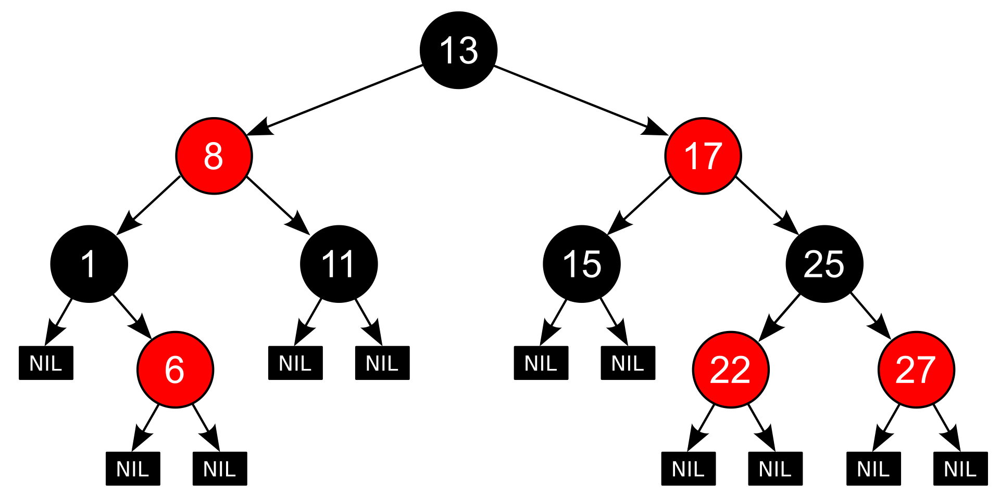
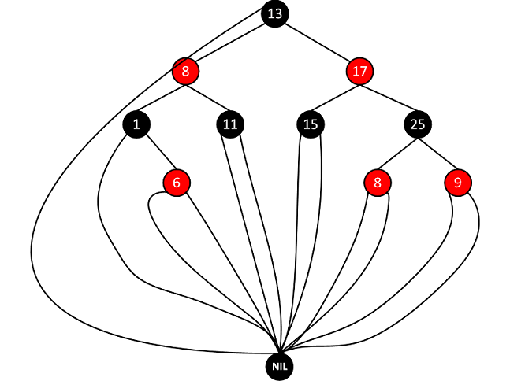
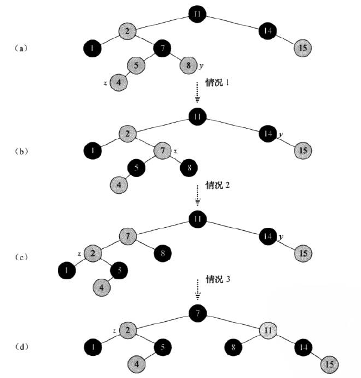
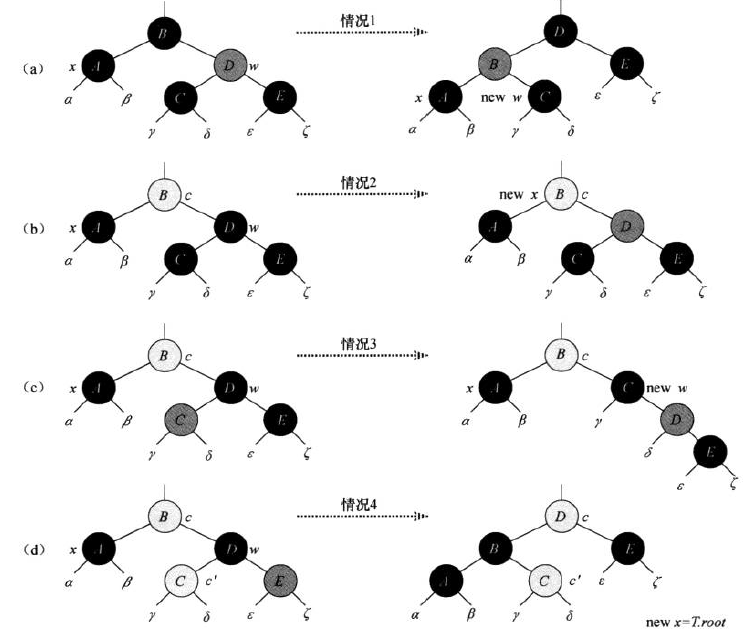

# 一.什么是红黑树？

红黑树（red-black tree）是一种二叉搜索树，其每个结点上增加了一个存储位来表示**结点的颜色（红或黑）**。通过对任何一条从根到叶子的简单路径上的各个结点的颜色进行约束，红黑树确保没有一条路径会比其它路径长出2倍，因而近似于平衡。

红黑树中进行**搜索、插入、删除**操作的时间复杂度均为$O(\text{log}(n))$。

红黑树具备的性质：

- 每个结点的颜色或是黑色或是红色。
- 根结点的颜色是黑色的。
- 每个叶节点（NIL）是黑色的。
- 红色结点的孩子都是黑色结点。
- 对每个结点，从该结点到其所有后代叶结点的简单路径上，均包含相同数量的黑色结点。

下图展示的便是一个红黑树的示例：



> AVL树相较于红黑树更平衡，这也使得AVL树的插入或删除需要更多的旋转。**若应用的插入和删除操作非常频繁**，用红黑树更合适。

对于红黑树，其树结点包含5个属性：

- `color`：结点颜色。
- `key`：结点的键。
- `left`：指向结点左孩子的指针。
- `right`：指向结点右孩子的指针。
- `p`：指向结点父亲的指针。

## 1.1 哨兵结点

为了方便处理红黑树中的边界条件，可以使用一个哨兵来代表NIL（**所有叶结点和根结点的父节点**）。

对于一棵红黑树$T$，哨兵$T.nil$是一个与树中普通结点有相同属性的对象，它的`color`属性为黑色，其它属性可以设置为任意值。带哨兵的红黑树示意图为：



> 使用哨兵结点还能节省空间。

# 二.红黑树的常见操作

## 2.1 旋转

对于红黑树，当进行插入和删除操作后，可能上述性质会被违反，因此需要通过旋转操作来维护。红黑树的旋转与之前介绍的类似，也包括左旋和右旋，其示意图如下：

```
T1,T2和T3都是子树
      
     y                                x
    / \          右旋                /  \
   x   T3   - - - - - - - >        T1   y 
  / \       < - - - - - - -            / \
 T1  T2          左旋                 T2  T3
```

左旋算法为：

```
// T表示红黑树，T.nil表示红黑树中的哨兵
LEFT_ROTATE(T, x)
1	y = x.right
2	x.right = y.left // 将y的左子树连接点x的右指针上
3	if y.left is not T.nil
4		y.left.p = x
5	y.p = x.p
6	if x.p is T.nil
7		T.root = y
8	else if x = x.p.left
9		x.p.left = y
10	else
11		x.p.right = y
12	y.left = x
13	x.p = y
```

右旋算法为：

```
RIGHT_ROTATE(T, y)
1	x = y.left
2	y.left = x.right
3	if x.right is not T.nil
4		x.right.p = y
5	x.p = y.p
6	if y.p is T.nil
7		T.root = x
8	else if y.p.left = y
9		y.p.left = x
10	else
11		y.p.right = x
12	x.right = y
14	y.p = x
```

## 2.2 插入

对于红黑树的结点插入，可以先像普通二叉搜索树一样进行操作并将插入的结点着色为红色，并对结点进行重新着色，使得重新满足红黑树的性质。

插入算法伪代码为：

```
// z表示待插入结点
RB_INSERT(T, z)
1	y = T.nil
2	x = T.root
3	while x != T.nil
4		y = x
5		if z.key < x.key
6			x = x.left
7		else x = x.right
8	z.p = y
9	if y == T.nil
10		T.root = z
11	else if z.key < y.key
12		y.left = z
13	else y.right = z
14	z.left = T.nil
15	z.right = T.nil
16	z.color = RED
17	RB_INSERT_FIXUP(T,z) // 对红黑树结点进行重新着色			
```

------

对于红黑树树，插入只会破坏性质2和性质4。对于性质1和3，由于新插入的红节点的两个子结点都是哨兵$T.nil$，所以继续成立。而对于性质5，由于插入结点是红色且其代替了黑色哨兵，因此从一个指定结点开始的每条简单路径上的黑孩子的个数都是相等的。

重新调整的辅助程序的伪代码为：

```
RB_INSERT_FIXUP(T, z)
1	while z.p.color = RED
2		if z.p == z.p.p.left
3			y = z.p.p.right
4			if y.color == RED // 情况1 z的叔结点y是红色的
5				z.p.color = BLACK
6				y.color = BLACK
7				z.p.p.color = RED
8				z = z.p.p
9			else
10				if z == z.p.right // 情况2 z的叔结点y是黑色的且z是一个右孩子
11					z = z.p
12					LEFT_ROTATE(T, z)
13				// 情况3 z的叔结点y是黑色的且z是一个左孩子
14 				z.p.color = BLACK
15				z.p.p.color = RED
16				RIGHT_ROTATE(T, z.p.p)
17		else
18			将上述操作的"left"和"right"交换，然后依次执行
19	T.root.color = BLACK // 恢复性质2
```

**上述循环中，$z$会不断沿树上移并保持红色，若$z.p$为红色，则会违反性质4，需要进一步调整。最后一行伪代码是用来确保最后不违反性质2**。2-16行算法伪代码对应的三种情况示意如下：



## 2.3 删除

对于红黑树结点的删除，其先执行普通二叉搜索树的删除步骤，然后需要**通过旋转和重新着色等操作来修正**，使之重新成为一棵红黑树。

删除的算法伪代码如下：

```
// 在红黑树T中用子树v代替子树u
RB_TRANSPLANT(T, u, v)
1	if u.p == T.nil
2		T.root = v
3	else if u = u.p.left
4		u.p.left = v
5	else u.p.right = v
6	v.p = u.p

RB_DELETE(T, z)
1	y = z
2	y-original-color = y.color // 记住y的原始颜色
3	if z.left == T.nil
4		x = z.right
5		RB_TRANSPLANT(T, z, z.right)
6	else if z.right == T.nil
7		x = z.left
8		RB_TRANSPLANT(T, z, z.left)
9	else
10		p = z.right // 寻找z的后继结点y
11		while p
12			y = p
13			p = p.left
14		y-original-color = y.color
15		x = y.right
16		if y.p == z // y是z的右孩子
17			x.p = y
18		else
19			RB_TRANSPLANT(T, y, y.right)
20			y.right = z.right
21			y.right.p = y
22		RB_TRANSPLANT(T, z, y)
23		y.left = z.left
24		y.left.p = y
25		y.color = z.color
26		if y-original-color == BLACK // y的原始颜色为黑色，删除或移动y会引起红黑性质的破坏
27			RB_DELETE_FIXUP(T, x)
```

在上述删除算法中，删除$y$后，$x$占据了原来$y$的位置，若结点$y$的颜色是黑色，会产生如下问题：

- 如果$y$是原来的根节点，而$y$的一个红色的孩子成为新的根结点，会违反性质2。
- 若$x$和$x.p$都是红色，则会违反性质4。
- 在树中移动$y$导致先去包含$y$的任何简单路径上的黑色结点个数少1个，会违反性质5。

由于删除$y$使得少了一个黑色结点，可以**使$x$包含一个额外的黑色**，这样性质5就不会违背，但$x$的颜色“红+黑”或“黑+黑”违反了性质1。即通过如此操作，使得现在的问题变成了需要解决违反1、2、4三个特性（通过RB_DELETE_FIXUP来解决）。

RB_DELETE_FIXUP算法的目标是将$x$额外所包含的黑色不断上移，直至：

- $x$指向红黑结点，此时将$x$设为黑色即可恢复红黑树的性质。
- $x$指向根结点，此时将$x$设置黑色即可。
- 执行适当的旋转和重新着色，退出循环。

在`while`循环中，$x$总是指向一个**具有双重黑色的非根结点**，其又分为下图所示的四种情况：



**情况1**：$x$的兄弟结点$w$是红色。

**情况2**：$x$的兄弟$w$是黑色的，$w$的两个孩子都是黑色的。

**情况3**：$x$的兄弟结点$w$是黑色的，$w$的左孩子是红色的，右孩子是黑色的。

**情况4**：$x$的兄弟结点$w$是黑色的，且$w$的右孩子是红色的。

算法伪代码具体为：

```
// x指向结点y的原始位置
RB_DELETE_FIXUP(T, x)
1	while x != T.root and x.color = BLACK
2		if x == x.p.left
3			w = x.p.right // 获取x的兄弟结点
4			if w.color == RED // 情况1
5				w.color = BLACK
6				x.p.color = RED
7				LEFT_ROTATE(T, x.p)
8				w = x.p.right
9			if w.left.color == BLACK and w.right.color == BLACK // 情况2
10				w.color = RED
11				x = x.p
12			else if w.right.color == BLACK // 情况3
13				w.left.color = BLACK
14				w.color = RED
15				RIGHT_ROTATE(T, w)
16				w = x.p.right
17			w.color = x.p.color // 情况4
18			x.p.color = BLACK
19			w.right.color = BLACK
20			LEFT_ROTATE(T, x.p)
21			x = T.root
22		else (same as then clause with "right" and "left" exchanged)
24	x.color = BLACK
```


# 参考资料

[Red–black tree wiki](https://en.wikipedia.org/wiki/Red%E2%80%93black_tree)

《算法导论》
