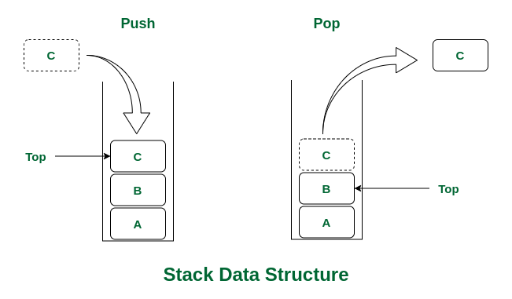

# 一.什么是栈

栈（stack）是一种先入后出（Fist In Last Out, FILO）的线性数据结构。对于栈而言，只能从栈顶压入数据（push）、或弹出栈顶数据。下图便展示了栈的两种常见操作：

> [图源](https://www.geeksforgeeks.org/stack-data-structure/)

# 二.栈的常见操作

栈中常见的两种操作包括：

- `Push`：往栈顶压入元素。
- `Pop`：删除栈顶的元素。
- 判断栈是否为空。

代码实现：[stack.h](https://github.com/sxwee/Data-Structures-and-Algorithms/blob/main/codes/ds/stack/stack.h)